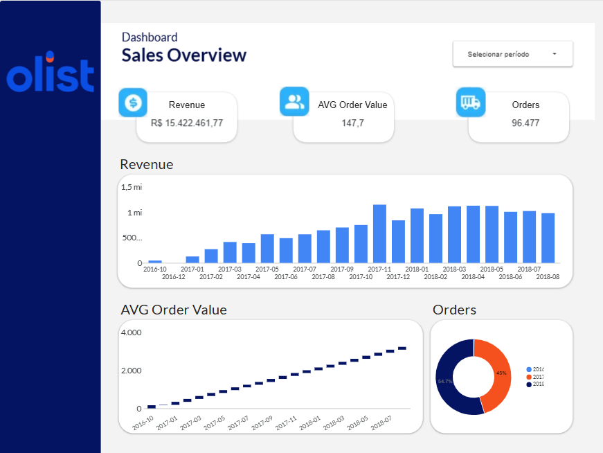
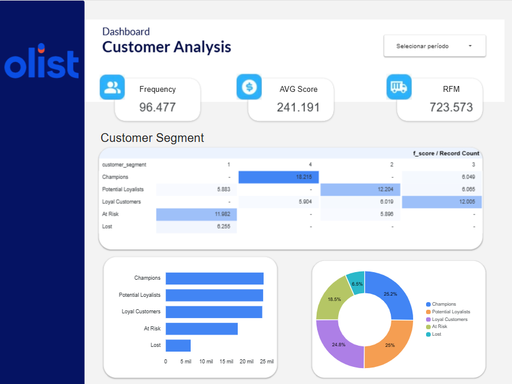
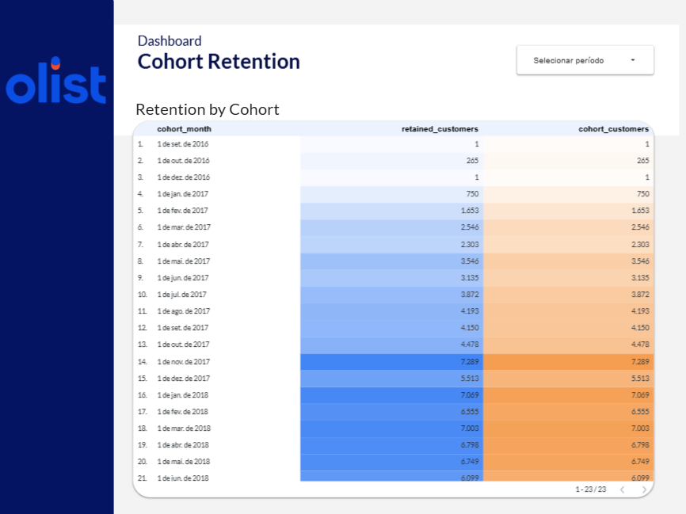

# E-commerce Sales Analysis 📊
> End-to-end analysis of a Brazilian e-commerce dataset covering revenue trends, customer segmentation (RFM), cohort retention, geographic performance, and category analysis.

[](https://cloud.google.com/bigquery)
[](https://datastudio.google.com/reporting/ccd24456-6f65-467c-a16c-c03b59bbb2c6)
[]()

---

## 📌 Business Context

**Industry:** E-commerce
**Stakeholders:** Marketing, Commercial, and Finance teams
**Business question:** *How has revenue evolved over time, which customer segments drive the most value, and where are the opportunities for growth?*

This project analyzes 96,000+ real orders from Olist, Brazil's largest e-commerce marketplace, covering 2017–2018. The goal was to understand revenue growth patterns, decompose revenue into new vs returning customers, identify high-value segments using RFM analysis, measure cohort retention, and deliver geographic and category-level performance insights.

---

## 🎯 Objectives

- [x] Analyze monthly revenue trends with MoM growth and 3-month rolling average
- [x] Decompose revenue into new vs returning customers (corrected for Olist's unique customer_id structure)
- [x] Segment customers using RFM methodology with NTILE(4) quartile scoring
- [x] Build a cohort retention matrix showing retention decay over 12 months
- [x] Analyze repeat purchase behavior — funnel, time-to-repeat, and order value uplift
- [x] Deliver geographic performance analysis by Brazilian state
- [x] Perform Pareto analysis on product categories
- [x] Deliver a 5-page executive dashboard in Looker Studio

---

## 🗂 Dataset

| Field | Details |
|---|---|
| **Source** | [Kaggle — Brazilian E-Commerce Public Dataset by Olist](https://www.kaggle.com/datasets/olistbr/brazilian-ecommerce) |
| **Size** | ~100K orders, 5 tables |
| **Period** | January 2017 – August 2018 (2016 excluded — partial year) |

**Tables used:**
- `orders` — order status and timestamps
- `order_items` — products and quantities per order
- `customers` — customer location and unique ID
- `payments` — payment method and value
- `products` — product category and attributes

---

## 🔧 Technical Approach

### Data Model

```
Kaggle Olist Dataset (5 CSVs)
        │
        ▼
BigQuery: analytics-portfolio-496419.olist.*   ← 5 raw tables (~96K orders)
        │
        ├── vw_revenue_analysis     ← monthly revenue, new/returning split, MoM growth, rolling avg
        ├── vw_new_vs_returning     ← 2-row aggregation for donut chart
        ├── vw_customer_ltv_rfm    ← one row per customer: RFM scores + segment
        ├── vw_customer_journey    ← repeat purchase funnel (uses customer_unique_id)
        ├── vw_repeat_windows      ← 3-row table for repeat window bar chart
        ├── vw_cohort_matrix       ← cohort retention matrix (pre-pivoted months 0–12)
        ├── vw_geographic_analysis ← revenue by state with RANK + Pareto + YoY
        └── vw_category_performance← category Pareto + cumulative share + YoY
                │
                ▼
        Looker Studio (5 pages)
```

> **Important note on customer_id:** The Olist dataset uses a unique `customer_id` per order, not per person. All analyses tracking returning customers use `customer_unique_id` from the `customers` table to correctly identify repeat buyers.

### SQL Queries

| Query | Description |
|---|---|
| [`01_revenue_analysis.sql`](./sql/01_revenue_analysis.sql) | Monthly revenue + new vs returning split + MoM growth (LAG) + 3M rolling average |
| [`02_cohort_retention.sql`](./sql/02_cohort_retention.sql) | Cohort retention — 3-CTE pipeline with self-join |
| [`03_customer_ltv_rfm.sql`](./sql/03_customer_ltv_rfm.sql) | RFM scoring with NTILE(4) quartiles and segment classification |
| [`05_customer_journey.sql`](./sql/05_customer_journey.sql) | Repeat purchase funnel — ROW_NUMBER to identify 1st/2nd order, time-to-repeat, uplift |
| [`06_geographic_analysis.sql`](./sql/06_geographic_analysis.sql) | Revenue by state with RANK, cumulative share (Pareto), YoY growth with LAG |
| [`07_category_performance.sql`](./sql/07_category_performance.sql) | Category Pareto analysis — cumulative revenue share, revenue rank, YoY growth |
| [`08_cohort_matrix.sql`](./sql/08_cohort_matrix.sql) | Full cohort retention matrix — pre-pivoted columns for months 0–12 |
| [`09_new_vs_returning.sql`](./sql/09_new_vs_returning.sql) | Aggregated new vs returning revenue split (2 rows) |
| [`10_repeat_windows.sql`](./sql/10_repeat_windows.sql) | Repeat purchase rate by time window — 30, 90 and 180 days |

### Looker Studio Implementation

| Document | Description |
|---|---|
| [`looker_studio/calculated_fields.md`](./looker_studio/calculated_fields.md) | Calculated fields, aggregation rationale, and visual field mappings per page |
| [`looker_studio/data_model.md`](./looker_studio/data_model.md) | Raw table schemas, view columns, RFM scoring logic, and cohort boundary notes |

---

## 📈 Key Findings

1. **Revenue driven almost entirely by new customers** — returning customer revenue never exceeded 2% of monthly total, confirming Olist operates as a pure acquisition marketplace
2. **3% repeat purchase rate** — only 2,801 of 93,357 unique customers placed a second order; 51% of those returned within 30 days
3. **Champions drive disproportionate value** — top RFM segment (25% of customers) generates ~40% of total revenue
4. **Retention collapses after month 0** — cohort matrix shows retention dropping from 100% to ~0.5% in month 1, stabilizing at 0.2–0.3% through month 12
5. **SP dominates geographically** — São Paulo alone accounts for ~40% of national revenue
6. **Top 10 categories = 80% of revenue** — classic Pareto concentration; `cama_mesa_banho` leads with R$580K in 2017

---

## 📊 Dashboard

**Tool:** Looker Studio
**Link:** [View live dashboard](https://datastudio.google.com/reporting/ccd24456-6f65-467c-a16c-c03b59bbb2c6)

| Page | Description |
|---|---|
| **Sales Overview** | Revenue KPIs · Monthly revenue + 3M rolling avg · New vs returning donut · AVG order value trend |
| **Customer Analysis** | RFM segment revenue · Customer segment distribution · Repeat purchase funnel by time window |
| **Cohort Retention** | Cohort retention matrix (heatmap) showing decay from month 0 to month 12 |
| **Geographic Analysis** | Filled map of Brazil · Top 10 states ranking · Revenue concentration KPIs |
| **Category Performance** | Pareto chart (bar + cumulative line) · Category performance table with freight % |

**Previews:**

| Sales Overview | Customer Analysis |
|---|---|
|  |  |



---

## 📁 Repository Structure

```
ecommerce-sales-analysis/
│
├── sql/
│   ├── 01_revenue_analysis.sql     ← Monthly revenue + new/returning split + MoM + rolling avg
│   ├── 02_cohort_retention.sql     ← Cohort retention (3-CTE pipeline, self-join)
│   ├── 03_customer_ltv_rfm.sql     ← RFM scoring with NTILE(4) + segment rules
│   ├── 05_customer_journey.sql     ← Repeat purchase funnel (uses customer_unique_id)
│   ├── 06_geographic_analysis.sql  ← Revenue by state with RANK + Pareto + YoY
│   ├── 07_category_performance.sql ← Category Pareto + cumulative share + YoY
│   ├── 08_cohort_matrix.sql        ← Full cohort matrix (pre-pivoted months 0–12)
│   ├── 09_new_vs_returning.sql     ← Aggregated new vs returning (2 rows for donut)
│   └── 10_repeat_windows.sql       ← Repeat windows 30/90/180 days (3 rows for bar chart)
│
├── looker_studio/
│   ├── calculated_fields.md        ← Calculated fields + visual field mappings per page
│   └── data_model.md               ← Raw table schemas, view columns, RFM & cohort notes
│
├── assets/
│   ├── Dashboard_Preview_p1_Looker_Studio.png
│   ├── Dashboard_Preview_p2_Looker_Studio.png
│   └── Dashboard_Preview_p3_Looker_Studio.png
│
└── README.md
```

---

## 🚀 How to Reproduce

1. Download the dataset from [Kaggle](https://www.kaggle.com/datasets/olistbr/brazilian-ecommerce)
2. Upload the 5 CSV files to BigQuery (dataset name: `olist`)
3. Run the SQL queries in order (01 → 10) to create the views
4. Connect the views to Looker Studio and build the dashboard

---

## 👩‍💻 About

Built by **Ana Paula Borges** · [LinkedIn](https://linkedin.com/in/ana-paula-d-araújo-borges) · [GitHub](https://github.com/ANAPBORGES)

*Senior Data Analyst & Team Leader with 10+ years in BI, DataViz, and Marketing Analytics.*
